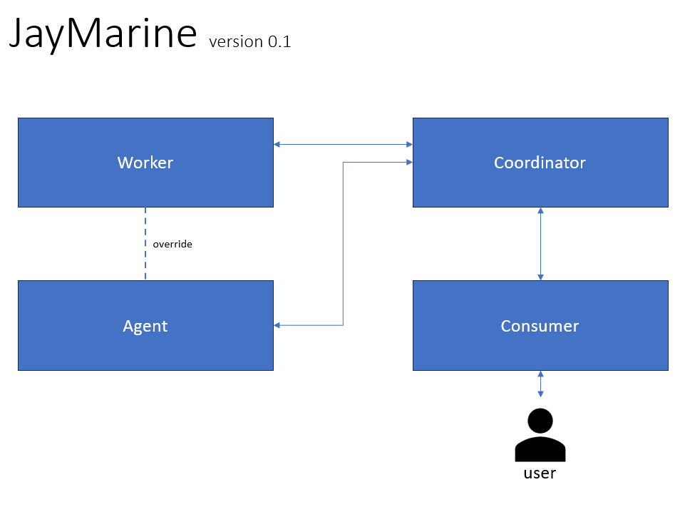

# jaymarine
An Open Alternative To Marine Solutions. What we try to create is effective, performant and cost effective solutions for automation enthusiasts. These tools are not commercial, or alternatives to commercial tools. These are built for fun and curriosity. We hope you use them, play with them and enjoy what they can do for you. 




## agent
An agent is a sensor for instance a temperature sensor. Its only job is to capture data and pass the data on to the co-ordinator. It is intentionally dumb.

Agent payload:
This data is sent from an agent to the co-ordinator.
```
{
	"version": "1",
	"data": "213",
	"ip": "192.168.75.21",
	"endpoint": "compass"
}
```
The data is a String that the co-ordinator will treat depending on the endpoint. So the endpoint will determine if the string should be cast to an int or interpreted as a string for example. A heartbeat response data back to coordinator from the agent is "OK". 


## worker
A worker is essentially an on/off switch. For example a fan that can turn on and off. It is intentionally dumb and has no awareness for why it is going on and off. It simply follows instructions from the co-ordinator. *For saftey we may want a worker to perform a sanity check with an agent, for this reason its considered that we may require a validation route from worker to agent. This should be an exception and not the rule*

Worker payload:
This data is sent from the co-ordinator to the worker.
```
{
	"version": "1",
	"data": "off",
	"ip": "192.168.75.21",
}
```
The data sent from the co-ordinator can only be a string.  The endpoint will determine if the string should be cast to an int or interpreted as a string for example. A heartbeat response data back to co-ordinator from the worker is "OK".


## coordinator
A coordinator is the brains of the operation. It takes in data from its agents, performs calculations and passes these instructions to the required worker. It is the heart of Jaymarine. All intelligence and design patterns should be implemented EXCLUSIVELY in the co-ordinator. The coordinator should be considered headless.


## consumer
A consumer can be a dashboard or any other interface that allows a human access to the co-ordinator. The coordinator and consumer are intentionally separate and MUST remain that way. This is to allow consumers to be made in a variety of different languages/tools and devices without impacting the core backbone.
